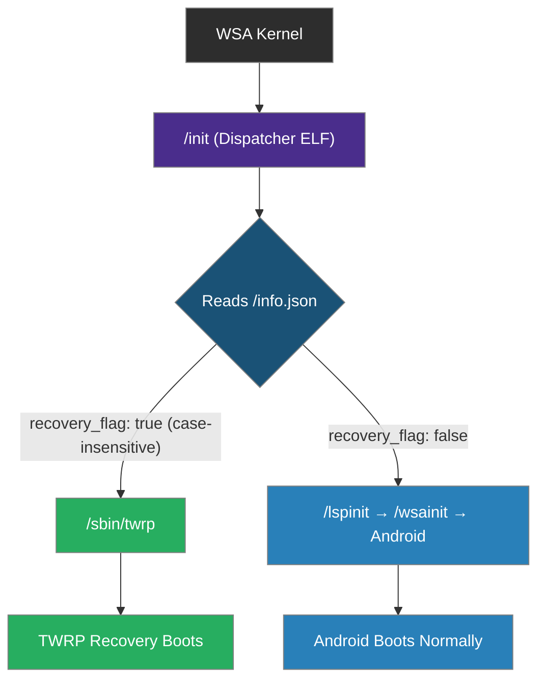
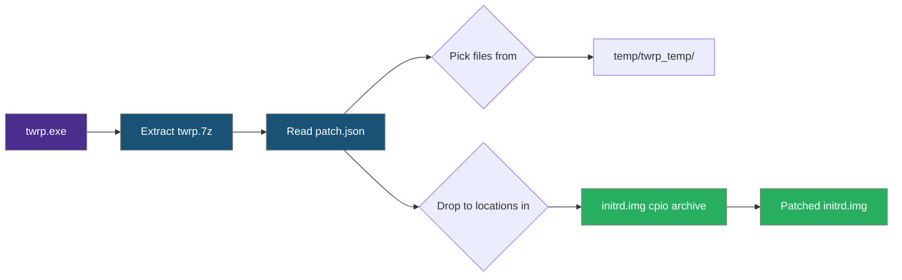
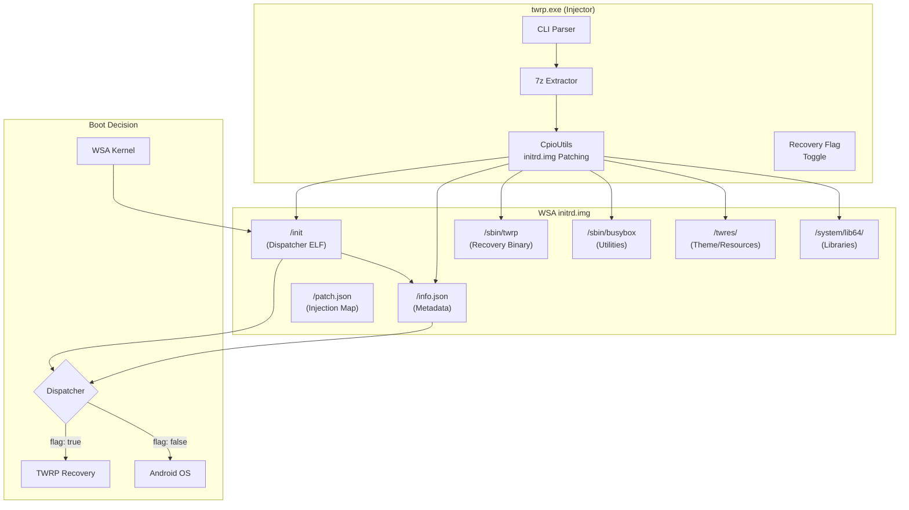

<div align="center">

<a href="https://github.com/WSA-Installer/twrp-for-wsa">
  
</a>

# TWRP for WSA

### Permanent TWRP Recovery for Windows Subsystem for Android


**One-click TWRP recovery injected into WSA — toggle between recovery and Android with a single command.**

Part of the [WSA Installer](https://github.com/WSA-Installer) organization.

[Download twrp.exe](https://github.com/WSA-Installer/twrp-for-wsa/releases/latest) · [Installation Guide](docs/installation.md) · [Commands](docs/commands.md) · [Architecture](docs/architecture.md) · [Source Code](src/twrp.py)

</div>

---

<br>

## Table of Contents

- [Introduction](#introduction)
- [Features](#features)
- [System Requirements](#system-requirements)
- [Quick Start](#quick-start)
- [CLI Reference](#cli-reference)
- [How It Works](#how-it-works)
- [Supported WSA Images](#supported-wsa-images)
- [Architecture](#architecture)
- [Build from Source](#build-from-source)
- [Documentation](#documentation)
- [Troubleshooting](#troubleshooting)
- [Community](#community)
- [Credits](#credits)
- [License](#license)

---

<br>

## Introduction

**TWRP for WSA** brings full [Team Win Recovery Project](https://twrp.me/) functionality to Windows Subsystem for Android. It works by injecting TWRP's ramdisk files directly into WSA's `initrd.img` and installing a custom dispatcher that decides at boot time whether to load TWRP or Android.

### What It Does

| Capability | Description |
|:-----------|:------------|
| **Permanent Recovery** | TWRP persists across reboots — no re-injection needed |
| **One-Click Inject** | Single command patches WSA initrd.img with TWRP files |
| **Boot Toggle** | Switch between TWRP recovery and Android via a flag in info.json |
| **ADB Access** | Connect to TWRP via ADB for backup, restore, and file operations |
| **Multi-Image Support** | Works with all 7 official WSA image variants (x64, ARM64, Amazon Fire) |
| **Source Build** | Automated TWRP builds via GitHub Actions from TWRP 14.1 source |

### Why TWRP for WSA?

The official WSA installation does not include any recovery mode. If something goes wrong — a bad Magisk module, a corrupted system partition, or a failed GApps installation — there is no way to restore without completely reinstalling WSA. TWRP for WSA solves this by providing:

- **Full NANDroid backups** before risky modifications
- **File manager** for manually fixing corrupted files
- **Terminal** for debugging and recovery operations
- **Flash capabilities** for installing ZIP packages

### Who Is This For?

- **Power Users** who customize WSA with Magisk, GApps, or custom modules
- **Developers** who need a safety net for testing system-level changes
- **Anyone** who wants the ability to backup and restore their WSA installation

---

<br>

## Features

### Core Features

| Feature | Description |
|:--------|:------------|
| Permanent Recovery | TWRP persists in WSA initrd.img across reboots |
| One-Click Inject | `twrp.exe --inject twrp.7z` patches initrd.img |
| Boot Toggle | `--enable-twrp` / `--disable-twrp` switches boot mode |
| Custom Dispatcher | ELF binary decides TWRP vs Android at boot |
| ADB Recovery Access | Connect via ADB port 58526 in recovery mode |
| Multi-Image Support | 7 WSA variants: Windows x64, ARM64, Amazon Fire |
| GitHub Actions Build | Automated TWRP compilation from source |
| Status Check | `--status` shows current state of all components |
| Granular Injection | Inject individual files or folders with `into` keyword |
| Safe Rollback | Restore original initrd.img at any time |

### TWRP Recovery Features

| Feature | Description |
|:--------|:------------|
| NANDroid Backup | Full system backup to virtual storage |
| NANDroid Restore | Restore from previous backup |
| Flash ZIP | Install Magisk, GApps, or custom modules |
| File Manager | Browse and edit files with root access |
| Terminal | Full shell access for debugging |
| Mount/Unmount | Manually mount partitions |
| Wipe | Factory reset, cache wipe, dalvik cache wipe |
| USB Mass Storage | Access WSA files from Windows Explorer |

<br>

## System Requirements

| Requirement | Minimum | Recommended |
|:------------|:--------|:------------|
| OS | Windows 10 (build 19041+) | Windows 11 22H2+ |
| WSA | Installed and functional | Latest version with Play Store |
| Disk Space | 50 MB free | 200 MB free |
| ADB | Platform tools installed | Latest platform-tools |
| Privileges | Administrator | Administrator |

### Required Windows Features

| Feature | Status | How It Works |
|:--------|:-------|:-------------|
| Windows Subsystem for Android | Must be installed | Core requirement |
| Developer Mode | Must be enabled in WSA settings | Required for ADB access |
| ADB Debugging | Must be enabled in WSA settings | Required for commands |

### Supported Environments

| Environment | Status |
|:------------|:-------|
| Windows 11 22H2+ |  |
| Windows 11 21H2 |  |
| Windows 10 2004+ (build 19041) |  |
| Windows 10 < 19041 |  |
| WSA with Google Play Store |  |
| WSA without Play Store |  |
| WSA with Magisk (root) |  |
| WSA without root |  |

<br>

## Quick Start

### Step 1 — Download

Download `twrp.exe` from the [latest release](https://github.com/WSA-Installer/twrp-for-wsa/releases/latest).

| File | Size | Description |
|:-----|:-----|:------------|
| `twrp.exe` | ~15 MB | CLI injector tool |
| `twrp.7z` | ~10 MB | TWRP ramdisk files (included with twrp.exe) |

### Step 2 — Inject TWRP

Open a terminal as administrator and run:

```cmd
twrp.exe --inject twrp.7z
```

This extracts the TWRP ramdisk files and patches them into WSA's `initrd.img`.

### Step 3 — Reboot into TWRP

```cmd
twrp.exe --enable-twrp
```

Restart WSA. The next boot will load TWRP recovery instead of Android.

### Step 4 — Reboot Back to Android

```cmd
twrp.exe --disable-twrp
```

Restart WSA. Android boots normally.

<br>

## CLI Reference

### Commands

| Command | Description |
|:--------|:------------|
| `twrp.exe --status` | Check current WSA and TWRP status |
| `twrp.exe --inject twrp.7z` | Extract 7z and inject TWRP into initrd.img |
| `twrp.exe --inject-file info.json` | Inject a single file into initrd.img |
| `twrp.exe --inject-folder twrp_files/` | Inject a folder into initrd.img |
| `twrp.exe --enable-twrp` | Set recovery flag to boot TWRP |
| `twrp.exe --disable-twrp` | Clear recovery flag to boot Android |
| `twrp.exe --inject twrp.7z --path D:\initrd.img` | Patch a specific initrd.img file |

### Examples

```cmd
:: Check status
twrp.exe --status

:: Inject TWRP
twrp.exe --inject twrp.7z

:: Inject with custom destination
twrp.exe --inject-file info.json into /config/

:: Enable TWRP and reboot
twrp.exe --enable-twrp
:: Now restart WSA from Windows Settings or run:
adb reboot recovery

:: Disable TWRP and reboot
twrp.exe --disable-twrp
adb reboot

:: Patch a specific initrd.img
twrp.exe --inject twrp.7z --path D:\WSA\initrd.img
twrp.exe --enable-twrp --path D:\WSA\initrd.img
```

> Full command reference: [docs/commands.md](docs/commands.md)

<br>

## How It Works



### Components

| Component | File | Purpose |
|:----------|:-----|:--------|
| Dispatcher | `/init` (ELF binary) | Reads info.json and decides which OS to boot |
| Metadata | `/info.json` | Contains `recovery_flag`, `wsa_version`, `twrp_support` |
| Injection Map | `/patch.json` | Maps TWRP files from 7z into the cpio archive |
| TWRP Binary | `/sbin/twrp` | Main TWRP recovery executable |
| BusyBox | `/sbin/busybox` | Multi-call binary for shell utilities |
| Theme | `/twres/` | TWRP UI theme and resources |
| Libraries | `/system/lib64/` | Android shared libraries for TWRP |

### Boot Flow

1. **WSA kernel loads `initrd.img`** from the WSA installation directory
2. **Dispatcher (`/init`) executes** — a small ELF binary compiled from `init.c`
3. **Dispatcher reads `/info.json`** from the ramdisk
4. **If `recovery_flag` is `"true"` (case-insensitive):**
   - Dispatcher executes `/sbin/twrp`
   - TWRP recovery boots with full touch interface
5. **If `recovery_flag` is `"false"` (case-insensitive):**
   - Dispatcher executes `/lspinit` → `/wsainit`
   - Android boots normally

### Inject Flow



> Full architecture details: [docs/architecture.md](docs/architecture.md)

<br>

## Supported WSA Images

| Variant | Version | Architecture | Filename |
|:--------|:--------|:-------------|:---------|
| Windows x64 | 2404.40000.2.0 | x86_64 | `microsoft.windows subsystem for android_2404.40000.2.0_neutral_~_8wekyb3d8bbwe.initrd.img` |
| Windows x64 | 2404.40000.10.0 | x86_64 | `microsoft.windows subsystem for android_2404.40000.10.0_neutral_~_8wekyb3d8bbwe.initrd.img` |
| Windows x64 | 2404.40000.0.0 | x86_64 | `microsoft.windows subsystem for android_2404.40000.0.0_neutral_~_8wekyb3d8bbwe.initrd.img` |
| Windows x64 | 2406.40000.7.0 | x86_64 | `microsoft.windows subsystem for android_2406.40000.7.0_neutral_~_8wekyb3d8bbwe.initrd.img` |
| Windows ARM64 | 2404.40000.10.0 | ARM64 | `microsoft.windows subsystem for android_2404.40000.10.0_neutral_~_8wekyb3d8bbwe.initrd.img` |
| Windows ARM64 | 2406.40000.13.0 | ARM64 | `microsoft.windows subsystem for android_2406.40000.13.0_neutral_~_8wekyb3d8bbwe.initrd.img` |
| Amazon Fire | 2404.40000.12.0 | x86_64 | `microsoft.windows subsystem for android_2404.40000.12.0_neutral_~_8wekyb3d8bbwe.initrd.img` |

> Full variant details: [docs/supported-images.md](docs/supported-images.md)

<br>

## Architecture



> Full architecture docs: [docs/architecture.md](docs/architecture.md)

<br>

## Source Code

TWRP for WSA is fully open source. The main tool is `src/twrp.py`.

### Project Structure

```
twrp-for-wsa/
├── src/
│   └── twrp.py              # Main CLI tool (~1500 lines)
├── docs/
│   ├── installation.md      # Installation guide
│   ├── commands.md          # CLI reference
│   ├── architecture.md      # How it works internally
│   ├── flow.md              # Boot and inject flow
│   ├── cli-reference.md     # Detailed CLI reference
│   ├── developer-guide.md   # Contributing guide
│   ├── adb.md               # ADB commands for TWRP
│   ├── variants.md          # WSA image variants
│   ├── supported-images.md  # All 7 WSA variant details
│   ├── troubleshooting.md   # Common issues and fixes
│   └── faq.md               # Frequently asked questions
├── assets/
│   └── twrp.png             # Project logo
├── .github/
│   ├── workflows/
│   │   └── build-twrp.yml   # GitHub Actions build workflow
│   └── PULL_REQUEST_TEMPLATE.md
├── init.c                   # Dispatcher source (compiled to ELF with musl-gcc)
├── info.json                # TWRP metadata template
├── patch.json               # Cpio injection map
├── requirements.txt         # Python dependencies
├── CODE_OF_CONDUCT.md       # Code of conduct
├── SECURITY.md              # Security policy
├── SUPPORT.md               # Support and FAQ
├── ROADMAP.md               # Planned features
├── CONTRIBUTING.md          # Contribution guidelines
├── LICENSE.md              # Source-Available / Community-Extension License
├── CHANGELOG.md             # Version history
└── README.md                # This file
```

### Requirements

| Requirement | Version |
|:------------|:--------|
| Python | 3.10+ |
| PySide6 | 6.5+ |
| Windows | 10 (build 19041+) or 11 |
| WSA | Installed and functional |
| ADB | Platform tools installed |

### Install & Run

```bash
# Clone
git clone https://github.com/WSA-Installer/twrp-for-wsa.git
cd twrp-for-wsa

# Install dependencies
pip install -r requirements.txt

# Check status
python src/twrp.py --status

# Inject TWRP
python src/twrp.py --inject twrp.7z

# Enable TWRP mode
python src/twrp.py --enable-twrp
```

### Build TWRP Recovery Image (GitHub Actions)

The TWRP recovery image is built automatically from source:

1. Go to [Actions](https://github.com/WSA-Installer/twrp-builder-wsa/actions)
2. Click **Build TWRP x86_64 for WSA**
3. Click **Run workflow**
4. Wait ~60 minutes
5. Download `twrp-x86_64-wsa` artifact

### Build Output

| File | Size | Description |
|:-----|:-----|:------------|
| `twrp.7z` | ~10 MB | TWRP ramdisk files for injection |
| `twrp.img` | ~20 MB | Raw cpio ramdisk image |

<br>

## Documentation

| Document | Description |
|:---------|:------------|
| [Installation Guide](docs/installation.md) | Step-by-step installation instructions |
| [CLI Commands](docs/commands.md) | Full reference for all twrp.exe commands |
| [CLI Reference](docs/cli-reference.md) | Detailed CLI reference with examples |
| [Boot & Inject Flow](docs/flow.md) | Complete boot and injection flow |
| [Architecture](docs/architecture.md) | How TWRP for WSA works internally |
| [ADB Commands](docs/adb.md) | ADB commands for TWRP recovery |
| [WSA Variants](docs/variants.md) | All 7 custom WSA image variants |
| [Supported Images](docs/supported-images.md) | All 7 WSA variant details |
| [Developer Guide](docs/developer-guide.md) | Contributing and development setup |
| [FAQ](docs/faq.md) | Frequently asked questions |
| [Troubleshooting](docs/troubleshooting.md) | Common issues and solutions |
| [Changelog](CHANGELOG.md) | Version history and release notes |
| [Security Policy](SECURITY.md) | Vulnerability reporting and security |
| [Support](SUPPORT.md) | Support channels and FAQ |
| [Roadmap](ROADMAP.md) | Planned features |

<br>

## Troubleshooting

### Quick Reference

| Issue | Solution |
|:------|:---------|
| ADB shows "device" (not "recovery") | TWRP not booted yet — restart WSA after enabling TWRP mode |
| TWRP not booting | Check if `twrp.exe --status` shows `recovery_flag: true` |
| Initrd.img not found | WSA must be installed first; check WSA installation path |
| ADB not connecting | Restart ADB server; enable Developer Mode only if needed for Android access |
| Want to restore original | `twrp.exe --disable-twrp` reverts to normal Android boot |

> Full troubleshooting guide: [docs/troubleshooting.md](docs/troubleshooting.md)

<br>

## Tech Stack

<div align="center">


</div>

<br>

## Community

<div align="center">

[](https://www.youtube.com/@AT_Tech_Zone)
[](https://buymeacoffee.com/mrcyberdev)
[](https://github.com/WSA-Installer)

</div>

<br>

## Credits

| Component | Source | Role |
|:----------|:-------|:-----|
| TWRP | [TeamWin](https://twrp.me) | Recovery project |
| TWRP Source Build | [minimal-manifest-twrp](https://github.com/minimal-manifest-twrp) | TWRP AOSP manifest |
| Dispatcher | `init.c` (this repo) | Boot decision binary (compiled with musl-gcc) |
| CLI Tool | `src/twrp.py` (this repo) | Injection, toggle, status commands |
| WSA Installer | [AT Tech Zone](https://www.youtube.com/@AT_Tech_Zone) | Parent project |
| WSA Builds | [MustardChef/WSABuilds](https://github.com/MustardChef/WSABuilds) | Pre-built WSA archives |

<br>

## License

This project is licensed under the **Source-Available / Community-Extension License** — see [LICENSE.md](LICENSE.md) for details.

<br>

---

<div align="center">

[](https://www.youtube.com/@AT_Tech_Zone)
[](https://buymeacoffee.com/mrcyberdev)
[](https://github.com/WSA-Installer)

---

*Built with care by [AT Tech Zone](https://www.youtube.com/@AT_Tech_Zone) — MR CYBER*


</div>
