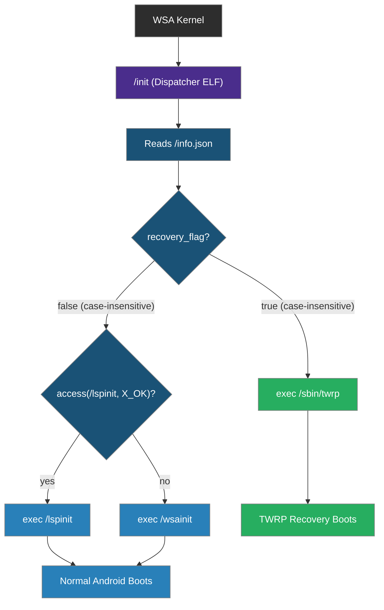

# Architecture

How TWRP for WSA works internally — boot chain, components, and injection system.

---

## Table of Contents

- [Overview](#overview)
- [Boot Chain](#boot-chain)
- [Components](#components)
- [info.json Fields](#infojson-fields)
- [CpioUtils — initrd Patching](#cpiousils--initrd-patching)
- [Injection Flow](#injection-flow)
- [Recovery Flag Toggle](#recovery-flag-toggle)
- [Module Images (ADMIN / USER)](#module-images-admin--user)
- [Boot Hook (Magisk Hook)](#boot-hook-magisk-hook)
- [IMG Manager](#img-manager)
- [Explorer .img Registration](#explorer-img-registration)

---

## Overview

TWRP for WSA works by modifying WSA's `initrd.img` — the initial ramdisk loaded by the kernel at boot. The initrd.img contains the `/init` binary, which is the first userspace process. By replacing this binary with a custom dispatcher, we control whether TWRP or Android boots.

### Key Insight

WSA's original `/init` is a simple script that chains to `/lspinit` → `/wsainit` → Android. Our dispatcher replaces this with a compiled ELF binary that reads `/info.json` and decides which path to take.

---

## Boot Chain

### Real WSA initrd Structure

WSA images come in two types:

**Type A — NoGApps (2MB initrd):**
```
/init       [regular]  2MB ELF — full WSL init binary (Microsoft)
/info.json  [regular]  metadata
```

**Type B — GApps/Magisk (288MB initrd):**
```
/init              [SYMLINK] -> "lspinit"
/lspinit           [regular]  430KB ELF — LSP init binary
/magiskinit        [regular]  278KB ELF — Magisk init (if present)
/wsainit           [regular]  2MB ELF — original WSA init (Magisk only)
/overlay.d/sbin/*  [regular]  GApps/Magisk images
/info.json         [regular]  metadata
```

### Normal WSA Boot (without TWRP)

**GApps/Magisk:**
```
WSA Kernel
  └── /init (symlink -> lspinit)
        └── /lspinit
              └── Android boots
```

**NoGApps:**
```
WSA Kernel
  └── /init (2MB WSL init ELF)
        └── Android boots
```

### TWRP-Injected Boot

After injection, `/init` is replaced with our dispatcher ELF:

```
WSA Kernel
  └── /init (custom dispatcher ELF — replaces original symlink or ELF)
        ├── Logs a one-line boot banner to /dev/kmsg
        ├── Reads /info.json
        ├── If recovery_flag == "true" (case-insensitive):
        │     └── exec /sbin/twrp
        │           └── TWRP Recovery boots
        └── If recovery_flag == "false":
              └── access("/lspinit", X_OK) ?
                    ├── yes → exec /lspinit   (GApps / Magisk images)
                    └── no  → exec /wsainit   (NoGApps images)
                                  └── Android boots
```

The original init is **not** renamed to `/init_orig` by the current
dispatcher — the Android path is chosen by probing the existing init
binaries with `access(X_OK)`, so a plain WSA image keeps booting without any
extra file being created.

### Mermaid Diagram


```mermaid
flowchart TD
    A[WSA Kernel] --> B["/init (Dispatcher ELF)"]
    B --> C[Reads /info.json]
    C --> D{recovery_flag?}
    D -->|"true (case-insensitive)"| E["exec /sbin/twrp"]
    D -->|"false (case-insensitive)"| I{"access(/lspinit, X_OK)?"}
    I -->|yes| F["exec /lspinit"]
    I -->|no| F2["exec /wsainit"]
    E --> G[TWRP Recovery Boots]
    F --> H[Normal Android Boots]
    F2 --> H

    style A fill:#2d2d2d,stroke:#808080,color:#fff
    style B fill:#4a2d8c,stroke:#808080,color:#fff
    style C fill:#1a5276,stroke:#808080,color:#fff
    style D fill:#1a5276,stroke:#808080,color:#fff
    style I fill:#1a5276,stroke:#808080,color:#fff
    style E fill:#27ae60,stroke:#808080,color:#fff
    style F fill:#2980b9,stroke:#808080,color:#fff
    style F2 fill:#2980b9,stroke:#808080,color:#fff
    style G fill:#27ae60,stroke:#808080,color:#fff
    style H fill:#2980b9,stroke:#808080,color:#fff
```

---

## Components

### Component Table

| Component | Path in initrd.img | Size | Purpose |
|:----------|:-------------------|:-----|:--------|
| Dispatcher | `/init` | ~1 KB | ELF binary that reads info.json and decides boot path |
| Metadata | `/info.json` | ~250 B | JSON with recovery_flag, wsa_version, twrp_support |
| Injection Map | `/patch.json` | ~250 B | Maps 7z contents to cpio destinations |
| TWRP Binary | `/sbin/twrp` | ~15 MB | Main TWRP recovery executable |
| BusyBox | `/sbin/busybox` | ~2 MB | Multi-call binary for shell utilities |
| Linker | `/sbin/linker64` | ~1 MB | Android dynamic linker for TWRP |
| Theme | `/twres/` | ~500 KB | TWRP UI theme and resources |
| Libraries | `/system/lib64/` | ~5 MB | Android shared libraries (liblog, etc.) |

### Dispatcher (init.c)

The dispatcher is a small C program compiled as a static ELF binary using `musl-gcc`:

```c
// Simplified logic (see init.c for actual implementation)
int main() {
    // Read /info.json
    char buf[1024];
    if (read_file("/info.json", buf, sizeof(buf)) > 0) {
        // Case-insensitive check for "recovery_flag": "true"
        if (cistrstr(buf, "\"recovery_flag\": \"true\"")) {
            // Boot TWRP
            execl("/sbin/twrp", "twrp", NULL);
        }
    }
    // Boot Android
    execl("/lspinit", "lspinit", NULL);
    execl("/wsainit", "wsainit", NULL);
    return 1;
}
```

Key properties:
- **Static binary** — no dynamic library dependencies at boot
- **Compiled with musl-gcc** — minimal libc, small binary size
- **Runs as PID 1** — first process, replaces Android init

### info.json

```json
{
    "recovery_flag": "true",
    "twrp_support": "true",
    "wsa_version": "2404.40000.2.0",
    "amazon_support": "false",
    "note": "TWRP Recovery enabled"
}
```

### patch.json

```json
[
    {"pick": "/init", "drop": "/"},
    {"pick": "/sbin/", "drop": "/sbin/"},
    {"pick": "/twres/", "drop": "/twres/"},
    {"pick": "/system/", "drop": "/system/"}
]
```

Each entry maps a source path (relative to the extracted 7z) to a destination prefix in the cpio archive.

---

## info.json Fields

| Field | Type | Values | Description |
|:------|:-----|:-------|:------------|
| `recovery_flag` | string | `"true"`, `"True"`, `"false"`, `"False"` | Controls boot mode. Both capitalized and lowercase are supported. |
| `twrp_support` | string | `"True"`, `"true"`, `"false"` | Whether TWRP files are present in initrd.img |
| `wsa_version` | string | e.g., `"2404.40000.2.0"` | Detected WSA version |
| `amazon_support` | string | `"true"`, `"false"` | Whether Amazon Appstore is supported |
| `note` | string | any text | Human-readable description (shown in `--status`, hidden when empty) |

### Flag Values

The `recovery_flag` field uses **string values**, not booleans:

| Value | Meaning |
|:------|:--------|
| `"true"` | Boot TWRP recovery (lowercase) |
| `"True"` | Boot TWRP recovery (capitalized) |
| `"false"` | Boot Android normally (lowercase) |
| `"False"` | Boot Android normally (capitalized) |

Both capitalized and lowercase variants are supported because different WSA image versions may use different conventions.

---

## CpioUtils — initrd Patching

### Cpio Archive Format

WSA's `initrd.img` is a [cpio archive](https://www.gnu.org/software/cpio/) in **newc format** (`070701` magic). This is the standard Linux initramfs format.

### CpioUtils Operations

| Method | Description |
|:-------|:------------|
| `scan_entries()` | Reads cpio entries into memory as a dict `{name: bytes}` |
| `read_file()` | Reads a single file entry from the cpio archive |
| `add_file()` | Adds a new file entry or replaces existing |
| `add_files()` | Adds all files from a directory recursively |
| `delete_file()` | Removes a file entry from the cpio archive |
| `pack()` | Writes modified entries back to cpio format |

### In-Place Replacement Constraint

The flag toggle uses **same-length byte replacement** within the cpio entry. This is why `info.json` uses padding:

```json
"recovery_flag": "true" 
"recovery_flag": "false"
```

Note the **trailing space** after `"true"` — this makes it exactly 6 characters, same as `"false"`. The space is ignored by JSON parsers.

Similarly for capitalized variants:

```json
"recovery_flag": "True" 
"recovery_flag": "False"
```

### How Injection Works

1. **Extract** the cpio archive from `initrd.img` into a dict of entries
2. **Resolve** file paths based on `patch.json` mapping
3. **Inject** files by adding/replacing entries in the dict
4. **Pack** the modified dict back into cpio format
5. **Write** the packed cpio back to `initrd.img`

### Compression

WSA's `initrd.img` is typically a **raw cpio** archive (no compression). The tool reads and writes the cpio format directly.

---

## Injection Flow

```mermaid
flowchart TD
    A["twrp.exe --inject twrp.7z"] --> B[Extract 7z to temp/]
    B --> C[Read patch.json]
    C --> D[Resolve source → destination paths]
    D --> E[Locate WSA initrd.img]
    E --> F[Create backup (.bak)]
    F --> G[Extract cpio entries]
    G --> H{For each patch.json entry}
    H --> I[Read source file from temp/]
    I --> J[Inject into cpio dict]
    J --> H
    H --> K[Pack modified cpio]
    K --> L[Write back to initrd.img]

    style A fill:#4a2d8c,stroke:#808080,color:#fff
    style C fill:#1a5276,stroke:#808080,color:#fff
    style E fill:#1a5276,stroke:#808080,color:#fff
    style G fill:#e67e22,stroke:#808080,color:#fff
    style J fill:#27ae60,stroke:#808080,color:#fff
    style L fill:#27ae60,stroke:#808080,color:#fff
```

---

## Recovery Flag Toggle

### Enable TWRP

```cmd
twrp.exe --enable-twrp
```

1. Extract cpio from initrd.img
2. Find `/info.json` entry
3. Replace `"recovery_flag": "false"` with `"recovery_flag": "true" `
   (or `"False"` → `"True" `)
4. Repack cpio and write back

### Disable TWRP

```cmd
twrp.exe --disable-twrp
```

1. Extract cpio from initrd.img
2. Find `/info.json` entry
3. Replace `"recovery_flag": "true" ` with `"recovery_flag": "false"`
   (or `"True" ` → `"False"`)
4. Repack cpio and write back

### Byte-Level Replacement

The replacement happens at the byte level within the cpio entry:

| Original | Replacement | Bytes |
|:---------|:-----------|:------|
| `"recovery_flag": "true" ` | `"recovery_flag": "false"` | Same (6 chars each) |
| `"recovery_flag": "True" ` | `"recovery_flag": "False"` | Same (6 chars each) |
| `"recovery_flag": "false"` | `"recovery_flag": "true" ` | Same (6 chars each) |
| `"recovery_flag": "False"` | `"recovery_flag": "True" ` | Same (6 chars each) |

This ensures the cpio archive size doesn't change, avoiding alignment issues.

---

## Module Images (ADMIN / USER)

System apps and the Magisk hook live in **two separate module images** that
are injected alongside the main initrd:

| Mode | Image | CPIO root | Default for |
|:-----|:------|:----------|:------------|
| ADMIN | `lsp_wsa-installer.img` | `wsa-installer`, `lsp_installer` | `--admin` |
| USER | `lsp_wsa-installer-user.img` | `wsa-installer-user`, `lsp_installer_user` | `--user`, and everything when no flag is given |

- `IMAGE_SPECS` holds the three paths for each mode; `resolve_mode()` maps a
  flag string to one of them and is called both by `main()` and by the GUI.
- `select_image()` re-points the `LSP_*` globals, so a single CLI call only
  ever touches one image.
- `--status` iterates `for m in ("admin", "user")` and prints both.
- `--admin` is gated: the SHA-256 hash in `ADMIN_PASSWORD_SHA256` is compared
  against the entered password (3 attempts), overridable with
  `WSA_ADMIN_PASSWORD`. The gate runs **before any archive is opened**.

Details: [admin-user-modules.md](admin-user-modules.md).

---

## Boot Hook (Magisk Hook)

| Constant / Function | Purpose |
|:--------------------|:--------|
| `HOOK_MODES` | `lspinit`/`magiskinit` 0750, `wsainit` 0777, `post-fs-data.sh` 0644 |
| `HOOK_DIRS` | `overlay.d`, `overlay.d/sbin` (created when missing) |
| `POSTFSDATA_ARCNAME` | `overlay.d/sbin/post-fs-data.sh` |
| `HOOK_MODES` + `add_hook_infrastructure()` | seed `overlay.d/sbin` |
| `hook_issues()` | audit: missing files, wrong mode, missing marker |
| `repair_hook_infrastructure()` | force rebuild from `fix.7z` |
| `override_hook_infrastructure()` | `--repaire-magisk-hook` entry point |
| `patch_postfsdata()` / `inject_uninstall_txt()` | append/remove the `uninstall.txt` handler block |

`POSTFSDATA_MARKER = b"# --- TWRP uninstall handler"` delimits the injected
block, so it can be removed idempotently.

Details: [magisk-hook.md](magisk-hook.md).

---

## IMG Manager

`--gui` opens `ImgManagerWindow` (PySide6). The archive stack is:

| Class | Role |
|:------|:-----|
| `ImgManagerWindow` | tree of entries, backup/restore, staged changes |
| `ArchiveViewerDialog` | open inner archives (cpio, tar, zip, 7z, gz/xz/bz2) |
| `NestedImgDialog` | drill into an `.img` nested inside the archive |
| `ScriptEditorDialog` | edit text entries in place, preserving mode |
| `CpioUtils` | the actual read/add/delete/pack engine |

Every save writes a `*.img.bak-YYYYMMDD-HHMMSS` sibling first; undo/redo use
snapshot hashes of the staged entry map.

Details: [img-manager.md](img-manager.md).

---

## Explorer .img Registration

`--register-img` writes an HKLM file association (HKCU fallback if not
elevated) so `*.img` opens in the IMG Manager:

1. `register_img_handler()` creates `HKLM\SOFTWARE\Classes\.img\WSAImg`
   with `WSA IMG Manager` and `open` commands.
2. `img_open_command()` builds `"…\twrp.exe" --gui "%1"`.
3. `--unregister-img` deletes exactly those keys and is idempotent.

Details: [open-with-registry.md](open-with-registry.md).
