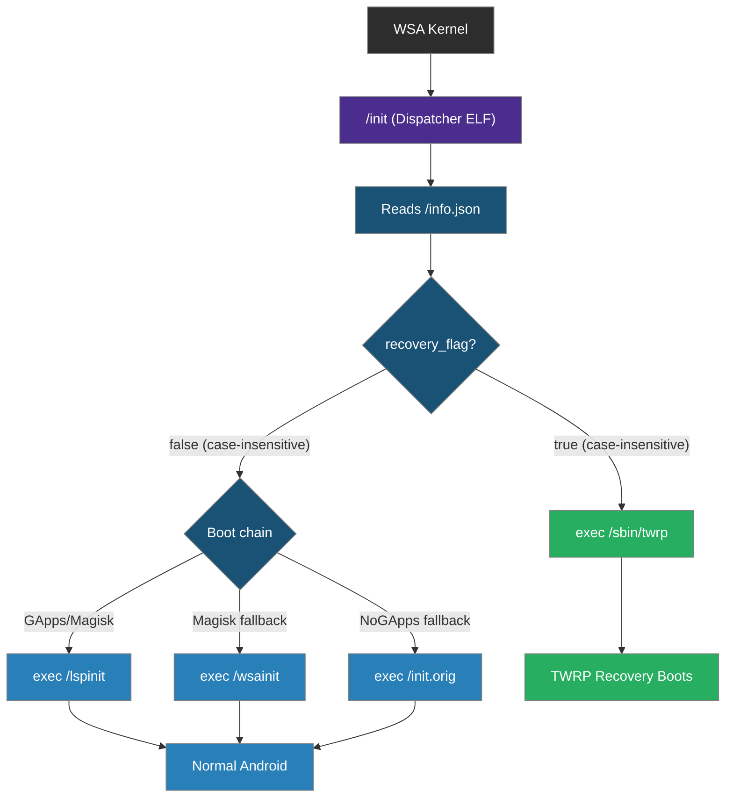
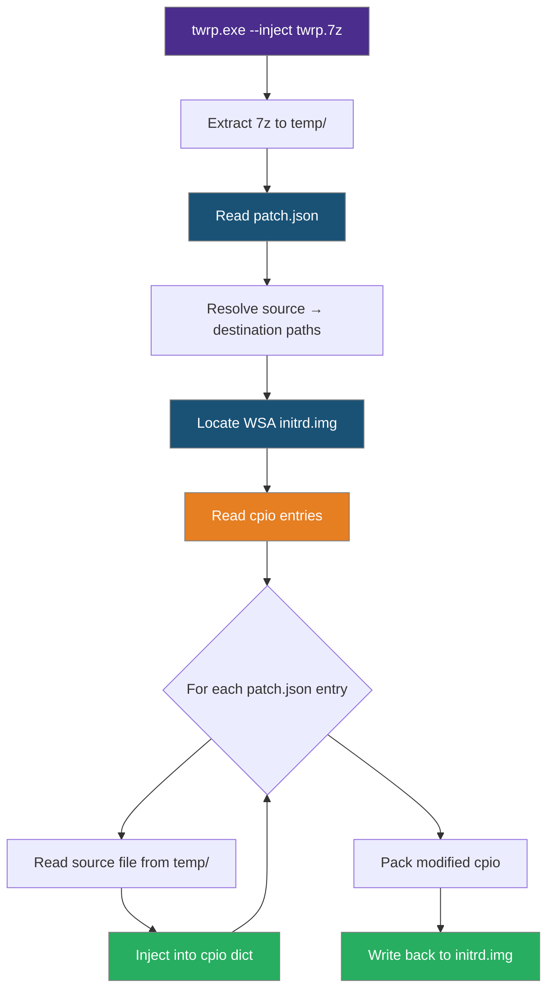

# Boot & Inject Flow

Complete documentation of how TWRP for WSA boots and how files are injected.

---

## Table of Contents

- [Boot Flow](#boot-flow)
- [Inject Flow](#inject-flow)
- [Flag Toggle Flow](#flag-toggle-flow)
- [State Dictionary](#state-dictionary)

---

## Boot Flow

### Overview

TWRP for WSA works by replacing WSA's original `/init` binary with a custom dispatcher. The dispatcher reads `/info.json` and decides whether to boot TWRP or Android.

### Normal WSA Boot (without TWRP)

**GApps/Magisk images:**
```
WSA Kernel
  └── /init (symlink -> lspinit)
        └── /lspinit
              └── Android boots
```

**NoGApps images:**
```
WSA Kernel
  └── /init (2MB WSL init ELF)
        └── Android boots
```

### TWRP-Injected Boot

After injection, `/init` is replaced with our dispatcher ELF:

```
WSA Kernel
  └── /init (custom dispatcher ELF)
        ├── Reads /info.json
        ├── If recovery_flag == "true" (case-insensitive):
        │     └── exec /sbin/twrp
        │           └── TWRP Recovery boots
        └── If recovery_flag == "false":
              ├── exec /lspinit (GApps/Magisk)
              ├── exec /wsainit (Magisk fallback)
              └── exec /init.orig (NoGApps — saved original)
                    └── Android boots
```

### Boot Sequence

1. **WSA kernel loads `initrd.img`** from the WSA installation directory
2. **Dispatcher (`/init`) executes** — a small ELF binary compiled from `init.c`
3. **Dispatcher reads `/info.json`** from the ramdisk
4. **Dispatcher checks `recovery_flag`** (case-insensitive string comparison)
5. **If `recovery_flag` is `"true"`:**
   - Dispatcher executes `/sbin/twrp`
   - TWRP recovery boots with full touch interface
6. **If `recovery_flag` is `"false"`:**
   - Dispatcher executes `/lspinit` → `/wsainit`
   - Android boots normally

### Mermaid Diagram



---

## Inject Flow

### Overview

Injection modifies WSA's `initrd.img` by adding TWRP files to the cpio archive. The process is non-destructive — existing files are replaced, new files are added.

### Step-by-Step Process

1. **Extract 7z** — `twrp.7z` is extracted to a temporary directory (`%TEMP%\twrp_temp\`)
2. **Read patch.json** — The injection map defines source → destination file mappings
3. **Locate initrd.img** — Auto-detected at WSA installation path, or specified via `--path`
4. **Read cpio archive** — The initrd.img is parsed into individual file entries
5. **Inject files** — For each entry in patch.json:
   - Read source file from temp directory
   - Add/replace entry in the cpio dictionary
6. **Pack cpio** — Modified entries are written back to cpio format
7. **Write initrd.img** — The packed cpio is written back to the original file

### patch.json Format

```json
[
    {"pick": "/init", "drop": "/"},
    {"pick": "/info.json", "drop": "/"},
    {"pick": "/sbin/", "drop": "/sbin/"},
    {"pick": "/twres/", "drop": "/twres/"},
    {"pick": "/etc/", "drop": "/etc/"},
    {"pick": "/system/lib64/", "drop": "/system/lib64/"}
]
```

Each entry maps a source path (relative to extracted 7z) to a destination prefix in the cpio archive.

### Mermaid Diagram



---

## Flag Toggle Flow

### Enable TWRP

```cmd
twrp.exe --enable-twrp
```

1. Extract cpio from initrd.img
2. Find `/info.json` entry
3. Replace `"recovery_flag": "false"` with `"recovery_flag": "true" `
   (or `"False"` → `"True" `)
4. Repack cpio and write back

### Disable TWRP

```cmd
twrp.exe --disable-twrp
```

1. Extract cpio from initrd.img
2. Find `/info.json` entry
3. Replace `"recovery_flag": "true" ` with `"recovery_flag": "false"`
   (or `"True" ` → `"False"`)
4. Repack cpio and write back

### Byte-Level Replacement

The replacement happens at the byte level within the cpio entry:

| Original | Replacement | Bytes |
|:---------|:-----------|:------|
| `"recovery_flag": "true" ` | `"recovery_flag": "false"` | Same (6 chars each) |
| `"recovery_flag": "True" ` | `"recovery_flag": "False"` | Same (6 chars each) |
| `"recovery_flag": "false"` | `"recovery_flag": "true" ` | Same (6 chars each) |
| `"recovery_flag": "False"` | `"recovery_flag": "True" ` | Same (6 chars each) |

This ensures the cpio archive size doesn't change, avoiding alignment issues.

---

## State Dictionary

The `twrp.py` tool uses a state dictionary to track the current operation. Key states:

| Key | Description |
|:----|:------------|
| `current_step` | Current wizard step (0-5) |
| `scan_stage` | System check stage |
| `initrd_path` | Path to WSA initrd.img |
| `twrp_7z_path` | Path to twrp.7z archive |
| `recovery_flag` | Current recovery flag value |
| `twrp_support` | Whether TWRP files are present |
| `wsa_version` | Detected WSA version |
| `adb_connected` | ADB connection status |
| `injection_complete` | Whether injection succeeded |
