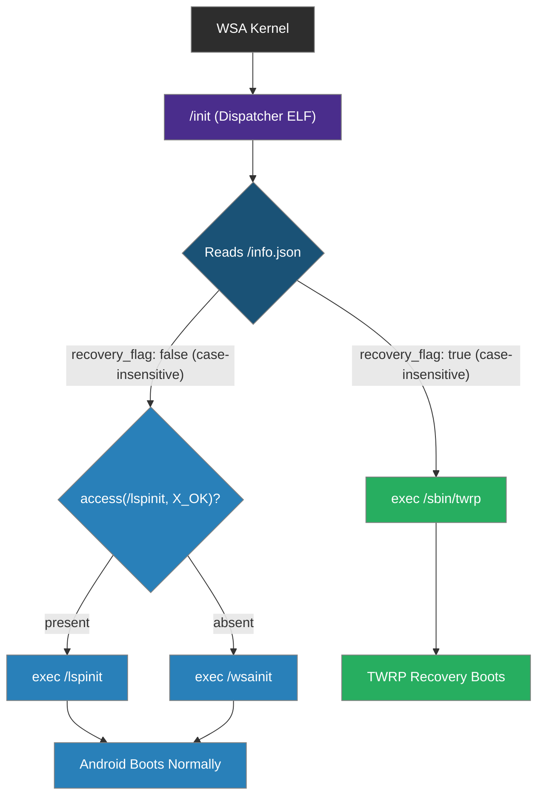
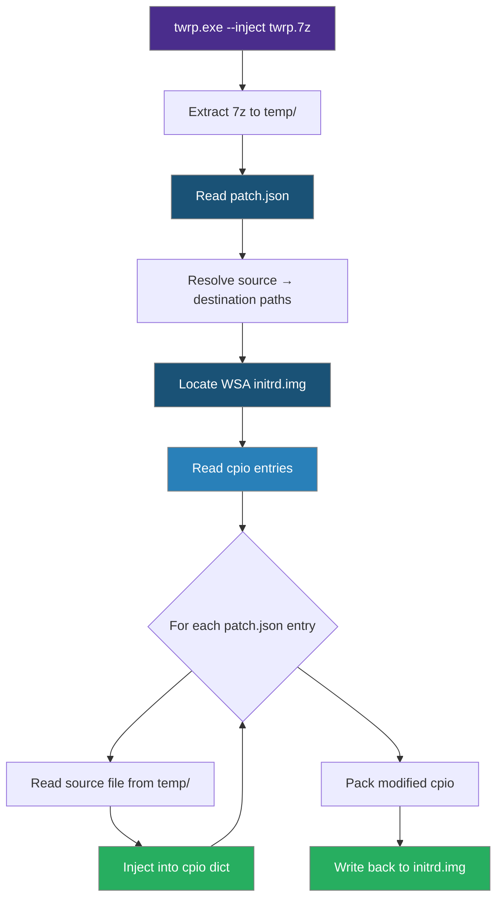
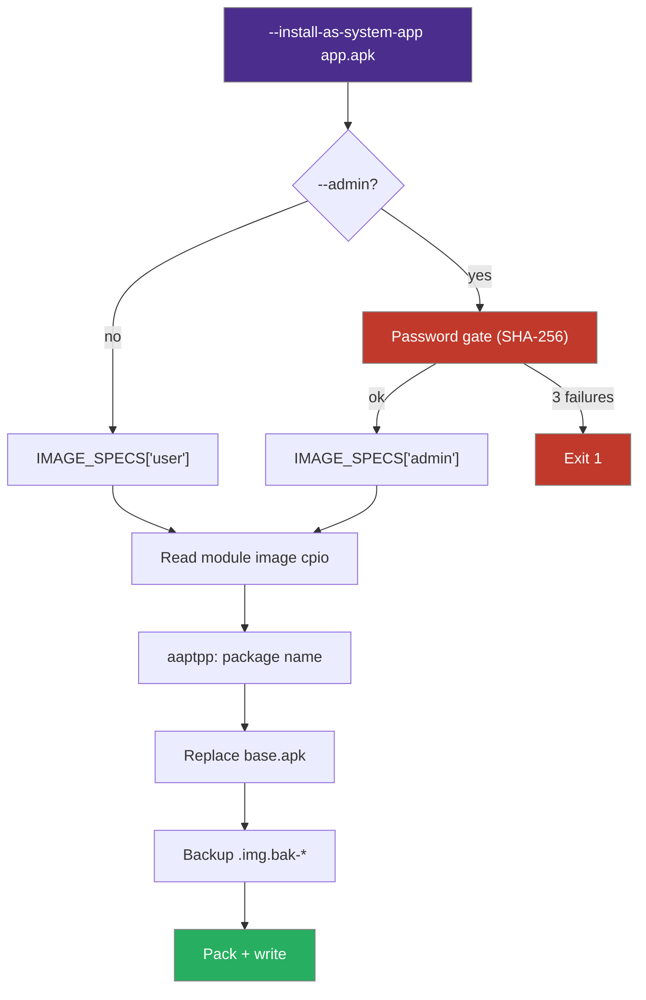

# Boot & Inject Flow

Complete documentation of how TWRP for WSA boots and how files are injected.

---

## Table of Contents

- [Boot Flow](#boot-flow)
- [Inject Flow](#inject-flow)
- [Flag Toggle Flow](#flag-toggle-flow)
- [System App Install / Update Flow](#system-app-install--update-flow)
- [Boltware List / Uninstall Flow](#boltware-list--uninstall-flow)
- [Boot Hook Install / Repair Flow](#boot-hook-install--repair-flow)
- [IMG Manager Pack Flow](#img-manager-pack-flow)
- [Register .img Flow](#register-img-flow)
- [State Dictionary](#state-dictionary)

---

## Boot Flow

### Overview

TWRP for WSA works by replacing WSA's original `/init` binary with a custom dispatcher. The dispatcher reads `/info.json` and decides whether to boot TWRP or Android.

### Normal WSA Boot (without TWRP)

**GApps/Magisk images:**
```
WSA Kernel
  └── /init (symlink -> lspinit)
        └── /lspinit
              └── Android boots
```

**NoGApps images:**
```
WSA Kernel
  └── /init (2MB WSL init ELF)
        └── Android boots
```

### TWRP-Injected Boot

After injection, `/init` is replaced with our dispatcher ELF:

```
WSA Kernel
  └── /init (custom dispatcher ELF — replaces original symlink or ELF)
        ├── Logs boot banner to /dev/kmsg
        ├── Reads /info.json
        ├── If recovery_flag == "true" (case-insensitive):
        │     └── exec /sbin/twrp
        │           └── TWRP Recovery boots
        └── If recovery_flag == "false":
              └── access("/lspinit", X_OK) ?
                    ├── yes → exec /lspinit   (GApps / Magisk)
                    └── no  → exec /wsainit   (NoGApps)
```

### Boot Sequence

1. **WSA kernel loads `initrd.img`** from the WSA installation directory
2. **Dispatcher (`/init`) executes** — a small ELF binary compiled from `init.c`
3. **Dispatcher reads `/info.json`** from the ramdisk
4. **Dispatcher checks `recovery_flag`** (case-insensitive string comparison)
5. **If `recovery_flag` is `"true"`:**
   - Dispatcher executes `/sbin/twrp`
   - TWRP recovery boots with full touch interface
6. **If `recovery_flag` is `"false"`:**
   - Dispatcher probes `/lspinit` with `access(X_OK)`
   - `/lspinit` when present, otherwise `/wsainit` — Android boots normally

### Mermaid Diagram


```mermaid
flowchart TD
    A[WSA Kernel] --> B["/init (Dispatcher ELF)"]
    B --> C{Reads /info.json}
    C -->|"recovery_flag: true (case-insensitive)"| D["exec /sbin/twrp"]
    C -->|"recovery_flag: false (case-insensitive)"| E{"access(/lspinit, X_OK)?"}
    E -->|"present"| E2["exec /lspinit"]
    E -->|"absent"| E3["exec /wsainit"]
    D --> F[TWRP Recovery Boots]
    E2 --> G[Android Boots Normally]
    E3 --> G

    style A fill:#2d2d2d,stroke:#808080,color:#fff
    style B fill:#4a2d8c,stroke:#808080,color:#fff
    style C fill:#1a5276,stroke:#808080,color:#fff
    style D fill:#27ae60,stroke:#808080,color:#fff
    style E fill:#2980b9,stroke:#808080,color:#fff
    style E2 fill:#2980b9,stroke:#808080,color:#fff
    style E3 fill:#2980b9,stroke:#808080,color:#fff
    style F fill:#27ae60,stroke:#808080,color:#fff
    style G fill:#2980b9,stroke:#808080,color:#fff
```

---

## Inject Flow

### Overview

Injection modifies WSA's `initrd.img` by adding TWRP files to the cpio archive. The process is non-destructive — existing files are replaced, new files are added.

### Step-by-Step Process

1. **Extract 7z** — `twrp.7z` is extracted to a temporary directory (`%TEMP%\twrp_temp\`)
2. **Read patch.json** — The injection map defines source → destination file mappings
3. **Locate initrd.img** — Auto-detected at WSA installation path, or specified via `--path`
4. **Read cpio archive** — The initrd.img is parsed into individual file entries
5. **Inject files** — For each entry in patch.json:
   - Read source file from temp directory
   - Add/replace entry in the cpio dictionary
6. **Pack cpio** — Modified entries are written back to cpio format
7. **Write initrd.img** — The packed cpio is written back to the original file

### patch.json Format

```json
[
    {"pick": "/init", "drop": "/"},
    {"pick": "/info.json", "drop": "/"},
    {"pick": "/sbin/", "drop": "/sbin/"},
    {"pick": "/twres/", "drop": "/twres/"},
    {"pick": "/etc/", "drop": "/etc/"},
    {"pick": "/system/lib64/", "drop": "/system/lib64/"}
]
```

Each entry maps a source path (relative to extracted 7z) to a destination prefix in the cpio archive.

### Mermaid Diagram


```mermaid
flowchart TD
    A["twrp.exe --inject twrp.7z"] --> B[Extract 7z to temp/]
    B --> C[Read patch.json]
    C --> D[Resolve source → destination paths]
    D --> E[Locate WSA initrd.img]
    E --> F[Read cpio entries]
    F --> G{For each patch.json entry}
    G --> H[Read source file from temp/]
    H --> I[Inject into cpio dict]
    I --> G
    G --> K[Pack modified cpio]
    K --> L[Write back to initrd.img]

    style A fill:#4a2d8c,stroke:#808080,color:#fff
    style C fill:#1a5276,stroke:#808080,color:#fff
    style E fill:#1a5276,stroke:#808080,color:#fff
    style F fill:#2980b9,stroke:#808080,color:#fff
    style I fill:#27ae60,stroke:#808080,color:#fff
    style L fill:#27ae60,stroke:#808080,color:#fff
```

---

## Flag Toggle Flow

### Enable TWRP

```cmd
twrp.exe --enable-twrp
```

1. Extract cpio from initrd.img
2. Find `/info.json` entry
3. Replace `"recovery_flag": "false"` with `"recovery_flag": "true" `
   (or `"False"` → `"True" `)
4. Repack cpio and write back

### Disable TWRP

```cmd
twrp.exe --disable-twrp
```

1. Extract cpio from initrd.img
2. Find `/info.json` entry
3. Replace `"recovery_flag": "true" ` with `"recovery_flag": "false"`
   (or `"True" ` → `"False"`)
4. Repack cpio and write back

### Byte-Level Replacement

The replacement happens at the byte level within the cpio entry:

| Original | Replacement | Bytes |
|:---------|:-----------|:------|
| `"recovery_flag": "true" ` | `"recovery_flag": "false"` | Same (6 chars each) |
| `"recovery_flag": "True" ` | `"recovery_flag": "False"` | Same (6 chars each) |
| `"recovery_flag": "false"` | `"recovery_flag": "true" ` | Same (6 chars each) |
| `"recovery_flag": "False"` | `"recovery_flag": "True" ` | Same (6 chars each) |

This ensures the cpio archive size doesn't change, avoiding alignment issues.

---

## System App Install / Update Flow

```cmd
twrp.exe --install-as-system-app app.apk            (USER module, default)
twrp.exe --install-as-system-app app.apk --admin    (ADMIN module)
twrp.exe --update-as-system-app app.apk
```

1. **Resolve mode** — `resolve_mode(mode)` → `IMAGE_SPECS[admin|user]`
2. **Gate** — `--admin` verifies the password (3 attempts) *before* any file
   is opened; `WSA_ADMIN_PASSWORD` overrides the prompt
3. **Locate image** — `lsp_wsa-installer[-user].img`, or `--path`
4. **Read cpio** — `CpioUtils.scan_entries()`
5. **Identify the APK** — package name from `aaptpp dump badging`
6. **Replace** — old `base.apk` removed, new one written under the app dir;
   `--update-as-system-app` fails cleanly if the app is not installed yet
7. **Pack + backup** — archive repacked, `.bak` sibling written first
8. **Report** — image path, mode tag and new package list printed

### Mermaid Diagram


```mermaid
flowchart TD
    A["--install-as-system-app app.apk"] --> B{--admin?}
    B -->|no| C["IMAGE_SPECS['user']"]
    B -->|yes| D["Password gate (SHA-256)"]
    D -->|ok| E["IMAGE_SPECS['admin']"]
    D -->|3 failures| X[Exit 1]
    C --> F[Read module image cpio]
    E --> F
    F --> G[aaptpp: package name]
    G --> H[Replace base.apk]
    H --> I[Backup .img.bak-*]
    I --> J[Pack + write]

    style A fill:#4a2d8c,stroke:#808080,color:#fff
    style D fill:#c0392b,stroke:#808080,color:#fff
    style J fill:#27ae60,stroke:#808080,color:#fff
    style X fill:#c0392b,stroke:#808080,color:#fff
```

---

## Boltware List / Uninstall Flow

```cmd
twrp.exe --list-of-boltware
twrp.exe --uninstall-boltware com.example.app
```

**List** — `list_boltware()` walks **both** module images, tags each package
`admin`/`user` and prints a de-duplicated union (one entry per package, admin
first).

**Uninstall** — `uninstall_boltware()`:

1. Scan both images for the package
2. If found only in USER → remove it directly
3. If found in ADMIN → requires `--admin` password
4. Append the package to `uninstall.txt` inside the image
5. `patch_postfsdata_uninstall()` ensures `post-fs-data.sh` contains the
   handler block delimited by `POSTFSDATA_MARKER`
6. On next boot the hook removes the app from the running system

---

## Boot Hook Install / Repair Flow

```cmd
twrp.exe --install-magisk-hook
twrp.exe --repaire-magisk-hook
```

1. `hook_issues()` audits the current image (files, modes, marker)
2. `add_hook_infrastructure()` creates `overlay.d` + `overlay.d/sbin`
   with the modes from `HOOK_MODES`
3. `patch_postfsdata()` injects/replaces the marked block in
   `overlay.d/sbin/post-fs-data.sh`
4. `--repaire-magisk-hook` → `override_hook_infrastructure()` unpacks
   `assets/fix.7z` and force-rebuilds the whole hook
5. Re-run `hook_issues()` → must return an empty list

---

## IMG Manager Pack Flow

```cmd
twrp.exe --gui
```

1. `ImgManagerWindow` loads the archive through `CpioUtils.scan_entries()`
2. User extracts / edits (`ScriptEditorDialog`) / stages changes
3. **Save** writes `initrd.img.bak-YYYYMMDD-HHMMSS` first
4. Staged map → `CpioUtils.pack()` → file written atomically
5. Undo/redo restore previous snapshots of the staged map
6. Inner archives are opened with `ArchiveViewerDialog`, nested `.img` with
   `NestedImgDialog` — repacking walks back out through the same stack

---

## Register .img Flow

```cmd
twrp.exe --register-img
twrp.exe --unregister-img
```

1. `register_img_handler()` prefers **HKLM** (`…\Classes\.img\WSAImg`)
2. Falls back to **HKCU** when not elevated
3. Writes the `open` command from `img_open_command()`:
   `"…\twrp.exe" --gui "%1"`
4. Explorer needs no restart — the association is read on demand
5. `--unregister-img` deletes only those keys and is idempotent
   (running it twice never errors)

---

## State Dictionary

The `twrp.py` tool uses a state dictionary to track the current operation. Key states:

| Key | Description |
|:----|:------------|
| `current_step` | Current wizard step (0-5) |
| `scan_stage` | System check stage |
| `initrd_path` | Path to WSA initrd.img |
| `twrp_7z_path` | Path to twrp.7z archive |
| `recovery_flag` | Current recovery flag value |
| `twrp_support` | Whether TWRP files are present |
| `wsa_version` | Detected WSA version |
| `adb_connected` | ADB connection status |
| `injection_complete` | Whether injection succeeded |
